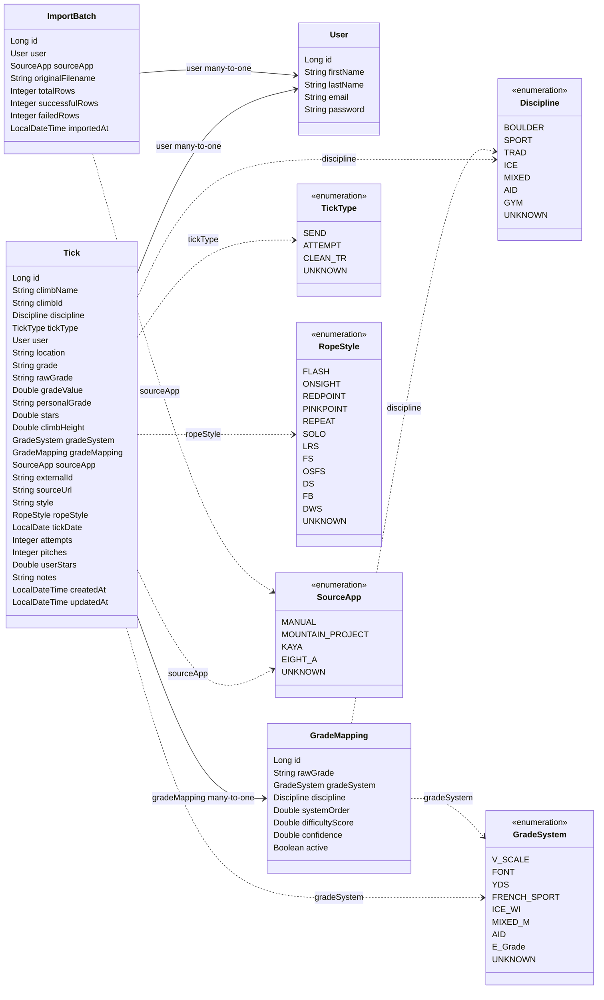

# TickList Model Diagram

Current backend model from `backend/src/main/java/com/riley/ticklist`.

Notes:

- `Tick`, `User`, `GradeMapping`, and `ImportBatch` are the current JPA entities.
- `Tick.user`, `Tick.gradeMapping`, and `ImportBatch.user` are the current `@ManyToOne` relationships.
- `User` maps to table `app_users`; the other entity table names use default JPA naming.
- `Climb` is not shown because there is no current `Climb` entity in the codebase yet.
- `Grade` is not shown because it is a package-private helper/value class, not a JPA entity and not currently linked from `Tick`.
